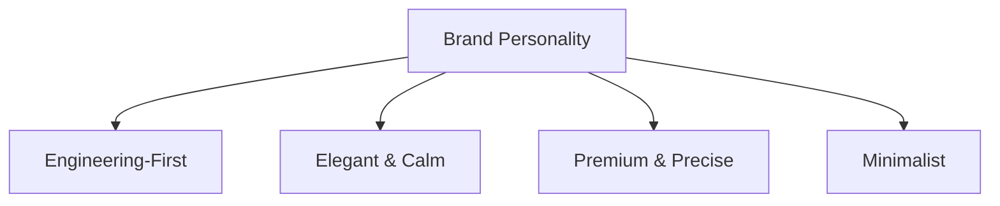

# Umlify Brand Strategy Document
*A Premium Visual Identity & Strategic Direction for the Next-Generation UML Editor*

---

## 1. Product Positioning

Umlify is not a casual whiteboarding tool, nor is it a complex, heavy enterprise modeling suite. It is a high-performance workspace designed to make technical system design fluid, fast, and visually spectacular.

### Target Audience
*   **Software Engineers & Architects:** Developers who need to model complex system behaviors, class hierarchies, or database schemas without fighting an interface.
*   **Technical Product Managers & Leaders:** Professionals who need to communicate system designs to teams and stakeholders with absolute clarity.
*   **Computer Science Students & Educators:** Individuals looking for a clean, compliant tool that doesn't feel like a legacy desktop application from the late 90s.

### Core Problem Solved
Traditional UML editors are either visual relics of the past (clunky desktop apps with endless menus and bad rendering) or general-purpose whiteboards (where drawing a simple inheritance line requires manually alignment and arrow adjustments). Umlify solves the speed and formatting problem: **it separates diagram logic from visual rendering, offering keyboard-driven layout generation with pixel-perfect presentation.**

### The Differentiation Strategy (Why Umlify?)
*   **Zero-friction Diagramming:** Instead of manually dragging lines and boxes, Umlify offers auto-routing, smart snapping, and semantic keyboard shortcuts.
*   **Developer-first Ergonomics:** The application feels like a modern IDE—command bars, keyboard shortcuts, markdown integration, and custom rendering themes.
*   **Presentation-ready Outputs:** By default, diagrams look elegant and ready to be pasted into a pitch deck, GitHub README, or design document.

### The First 5 Seconds (Visitor Emotion)
*   **Awe & Relief:** The visitor feels a sense of quiet sophistication. "Finally, a technical design tool built with the care and aesthetics of a modern developer tool."
*   **Empowerment:** The speed of the UI is immediately apparent. The visitor feels like they can think and design at the speed of thought.

### The Lasting Takeaway
"Umlify is the cleanest, fastest, and most elegant way to design professional diagrams in the browser."

---

## 2. Brand Personality

The Umlify brand personality is defined by four core traits, balancing engineering rigor with high-end digital design.



### Engineering-First (Structured, Logical, Functional)
*   *Why:* Our audience writes code and thinks in systems. The brand should respect their intelligence. We avoid patronizing language, colorful cartoons, or generic marketing fluff. The visual language uses grid lines, code-like structures, and keyboard-centric indicators to signal that the tool is built for builders.

### Elegant & Calm (Low Eye-Strain, Distraction-Free, Grounded)
*   *Why:* System design requires deep focus. A bright, cluttered UI with constant popups generates cognitive fatigue. Umlify utilizes muted backgrounds, generous spacing, and a quiet, dark-mode-first aesthetic to create an environment where engineers can focus for hours.

### Premium & Precise (Pixel-Perfect, High-Fidelity, Structured)
*   *Why:* If the tool itself looks unpolished, users will not trust it to model critical systems. We use 1px borders, subtle sub-pixel alignments, and premium typography to communicate that Umlify is a high-grade tool designed for professionals.

### Minimalist (Intentional, Essential, Focused)
*   *Why:* Extra buttons, heavy gradients, and decorative shapes add visual noise. Every element on the screen must serve a functional purpose. If a layout component does not aid understanding or speed, it does not belong in the interface.

---

## 3. Design Principles

Every future page, component, and interaction in Umlify must be guided by these seven principles.

### I. Clarity Before Decoration
Functionality must never be sacrificed for visual style. Every UI element, line, or icon must represent a clear action or semantic relationship. We do not add decorative graphic elements unless they serve to guide the user's eye or structure information.

### II. Generous & Structured Spacing
Layouts must breathe. We use a strict 8px grid system to enforce spatial hierarchy. Instead of cluttering elements, we rely on whitespace to group related concepts, making the interface feel premium and scannable.

### III. Typography Over Graphics
We prioritize clean typography, mathematical hierarchies, and strong contrast over arbitrary illustrations or heavy imagery. The content—the diagrams and code—is the hero of the application.

### IV. Subtle, Purposeful Animation
Motion must be used to explain relationships, reinforce hierarchy, or indicate state changes. We avoid heavy, loop-based animations that degrade browser performance. A transition should feel like a physical, tactile click—fast and crisp.

### V. Minimal Visual Noise
We limit the number of borders, background colors, and active colors on a page. Panels should blend together using subtle depth variations rather than harsh dark lines. This keeps the user focused on the diagram canvas.

### VI. Keyboard-First Architecture
The UI should suggest efficiency. Where possible, show subtle keyboard shortcuts (e.g., `⌘K`, `Tab`, `Esc`) inline. The landing page should visually demonstrate that diagrams can be constructed entirely without lifting hands from the keyboard.

### VII. Quality Over Quantity
We present fewer, highly refined features rather than a massive list of half-baked tools. On the landing page, this means showcasing three spectacular features beautifully rather than listing thirty generic bullet points.

---

## 4. Visual Language

The visual direction of Umlify is modern, high-contrast, and deeply tactile.

```
┌────────────────────────────────────────────────────────┐
│  Layer 3: Interactive elements, tooltips, active states │ [Glow / Accents]
├────────────────────────────────────────────────────────┤
│  Layer 2: Panels, cards, dropdowns (elevated surface)  │ [Slate Slate / Glass]
├────────────────────────────────────────────────────────┤
│  Layer 1: Main content canvas (mid-depth surface)      │ [Dark Charcoal]
├────────────────────────────────────────────────────────┤
│  Layer 0: Core app background (deepest surface)         │ [Obsidian Black]
└────────────────────────────────────────────────────────┘
```

*   **Background Philosophy (Layered Depth):** We use a multi-layered dark scheme. The lowest background layer is an obsidian black (`#09090B`). Panels, sidebars, and cards use slightly lighter slate tones (`#18181B` or `#27272A`) to establish a clear spatial hierarchy.
*   **Light vs. Dark Theme:** Dark theme is the default and hero state, mirroring modern code editors. However, the light theme must not be an afterthought; it should feature pure, high-contrast white surfaces, warm gray panels, and razor-sharp dark-gray typography.
*   **Borders & Outlines:** We replace soft drop shadows with crisp, 1px borders (`rgba(255,255,255,0.08)` in dark mode). This reflects the technical nature of UML (boxes, links, nodes).
*   **Gradients:** Restrained and directional. We avoid multi-color "rainbow" gradients. Instead, we use monochromatic transitions (e.g., deep charcoal to black) or a single-color accent fade to draw attention to call-to-actions.
*   **Border Radius:** Modern, tight curves. We use `6px` for small elements (inputs, buttons) and `12px` for panels and cards. Anything larger feels too playful and unscientific.
*   **Glass Effects:** Used exclusively for floating overlays (e.g., navigation bars, modal dialogs, context menus). The background blur should be high (`20px`) with a low opacity white/black tint to maintain legibility.
*   **Iconography:** Custom, 24px grid icons with a consistent `1.5px` stroke weight. We avoid filled icons unless they represent an active state.
*   **Illustrations & Visual Assets:** No generic, cartoonish vector illustrations. Instead, we use actual high-fidelity app screenshots, clean UI mockups, and abstract vector renderings of UML structures (nodes, inheritance trees, connector paths) rendered in our primary brand colors.

---

## 5. Typography

Typography is the voice of the product. Umlify uses a clean, highly structured typographic system optimized for screen readability and code representation.

| Hierarchy | Font Family | Size | Weight | Line Height | Letter Spacing |
| :--- | :--- | :--- | :--- | :--- | :--- |
| **Hero Heading** | Sans-Serif (Geist / Inter) | 56px - 64px | 700 (Bold) | 1.1 | -0.04em |
| **Section Title**| Sans-Serif (Geist / Inter) | 32px - 40px | 600 (Semi-Bold)| 1.2 | -0.02em |
| **Sub-headings** | Sans-Serif (Geist / Inter) | 18px - 20px | 500 (Medium) | 1.4 | -0.01em |
| **Body Copy** | Sans-Serif (Geist / Inter) | 15px - 16px | 400 (Regular) | 1.6 | 0 |
| **Code / Syntax**| Monospace (JetBrains Mono) | 14px | 400 (Regular) | 1.5 | 0 |

### Typographic Rationale
*   **Geist / Inter:** A clean, highly legible geometric sans-serif that excels at small interface labels while feeling modern and authoritative in large sizes.
*   **JetBrains Mono / SF Mono:** A developer-centric monospace font used for code snippets, markdown notation, and keyboard shortcut labels. It reinforces the engineering-first identity of the tool.
*   **Tight Heading Kerning:** Large titles are kerned tightly (`-0.04em`) to create a compact, punchy editorial look similar to high-end design tools like Framer and Linear.

---

## 6. Color System

The Umlify color system relies on high contrast, dark backgrounds, and single-point vibrant accents to guide the user's attention.

```
Backgrounds  [ Obsidian (#09090B) ─── Slate (#18181B) ─── Zinc (#27272A) ]
Text         [ Primary (#FAFAFA) ────── Muted (#A1A1AA) ───── Disabled (#52525B) ]
Accents      [ Cobalt (#2563EB) ─────── Teal (#0D9488) ────── Amber (#D97706) ]
```

### Base Palette
*   **Primary Background (`#09090B`):** Pure obsidian. Provides maximum contrast for diagram canvases and code blocks.
*   **Secondary Background (`#18181B`):** Sleek charcoal for panels, sidebars, and card elements.
*   **Borders (`#27272A` / `rgba(255,255,255,0.08)`):** Crisp boundaries that maintain order without creating visual clutter.

### Text Hierarchy
*   **Primary Text (`#FAFAFA`):** Near-white for active text and titles, reducing contrast-induced eye strain compared to pure white.
*   **Secondary Text (`#A1A1AA`):** Muted zinc for body text, descriptions, and secondary metadata.
*   **Muted Text (`#52525B`):** Darker zinc for helper text, disabled states, and keyboard shortcut indicators.

### Accent & Semantic Colors
*   **Brand Accent - Cobalt Blue (`#3B82F6`):** Used sparingly for primary call-to-actions, active selection boundaries, and highlights.
*   **Success - Emerald Teal (`#10B981`):** Clean green for success states, completed tasks, and saving indicators.
*   **Warning - Amber Gold (`#F59E0B`):** Warns users of syntax errors or overwrite actions.
*   **Error - Crimson Red (`#EF4444`):** Flags compilation failures or invalid UML connectors.

---

## 7. Motion Philosophy

Motion should not be decorative; it is a critical feedback system that makes the digital interface feel physical, fast, and responsive.

### Rules of Motion

1.  **Immediate Response (Zero Lag):** All hover states and button presses must feel instantaneous. We use `cubic-bezier(0.16, 1, 0.3, 1)` (ease-out-expo) for transitions, starting fast and decelerating smoothly.
2.  **Reinforce Hierarchy:** When panels open or modals appear, they should scale slightly (e.g., from `98%` to `100%`) and fade in. This mimics physical depth—bringing the focus forward.
3.  **Micro-Interaction Feedback:** Interactive components should offer tactile cues. For example, hovering over a keyboard shortcut indicator should highlight the keys; copying a diagram link should trigger a quick, satisfying checkmark bounce.
4.  **No Scroll-Jacking:** Never interfere with the user's native scrolling speed. Avoid parallax animations that force a user to scroll multiple times to reveal a single line of text.
5.  **Dampened Transitions:** Animation duration must be kept under `200ms` for small elements and `300ms` for larger panels. Anything slower makes the application feel heavy and sluggish.

---

## 8. Brand Inspirations

We draw distinct elements of inspiration from industry leaders, adapting their best practices to fit Umlify's unique workflow.

*   **Linear (Precision & Efficiency):** We admire their command menu (`⌘K`) design, dense layout structure, keyboard-first focus, and beautiful dark aesthetics. We want Umlify to feel like the "Linear of diagramming."
*   **Vercel (Typographic Authority):** Their clean use of high-contrast text, absolute minimalism, and sleek monochrome layouts shows how powerful an interface can be without relying on graphic assets.
*   **Raycast (Speed & Execution):** Their zero-latency search, command-line interface, and compact lists inspire our quick-insert and quick-routing controls.
*   **Framer (Layout Fluidity):** Their smooth workspace canvas, zoom controls, and polished, tactile sidebar panels set the benchmark for our diagram editor.
*   **Apple (Material Depth):** Their subtle use of blur, depth layers, and rounded corners guides our panel hierarchy and floating overlay system.
*   **Stripe (Trust & Detail):** Their flawless alignment, clean tabular presentations, and pixel-perfect execution of technical pages inspire our marketing structures and billing dashboards.

---

## 9. Things to Avoid

To maintain a premium product identity, we must explicitly reject common SaaS landing page trends.

*   **The "Vaporwave" Mesh Gradient:** Avoid giant, glowing pink/purple blobs behind every section. They distract from the content and feel generic and dated.
*   **Fluffy SaaS Buzzwords:** No phrases like "Next-gen AI-driven collaborative diagram paradigm." We describe the product with absolute precision: "Create and edit professional UML diagrams in the browser."
*   **Cartoon Illustrations:** Avoid isometric drawings of people holding oversized pencils or climbing giant gear wheels. Umlify is a professional engineering tool; we show diagrams, syntax trees, and clean interfaces.
*   **Excessive Glassmorphism:** Cards should not look like frosted glass unless they are floating overlays. Applying glass effects to every static card creates a muddy, unreadable layout.
*   **Scroll-Jacking / Heavy Animations:** Avoid forcing the viewport to jump to specific points or loading massive Lottie assets that drop the framerate on low-end laptops.
*   **Feature Overload:** Do not showcase a massive list of secondary features. The landing page must focus on the primary value proposition: **Speed, Precision, and Clarity.**
