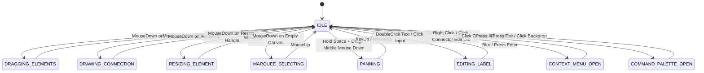

# Interaction Engine Architectural Design

This document outlines the architectural transition of Umlify from a component-driven editor into an **engine-driven editor**. It designs a centralized **Interaction Engine** which acts as the single authority of truth for all canvas interaction modes, eliminating event listener collisions and state desynchronization.

---

## 1. Audit of Current Interaction States

Currently, editor interaction states are scattered across multiple components and stores, using separate, uncoordinated boolean flags:

*   **Marquee Selection**: Tracked via `isSelecting` (ref boolean) in `Canvas.vue`.
*   **Element Dragging**: Tracked via `isDraggingElements` (ref boolean) in `Canvas.vue`.
*   **Connection Drawing**: Tracked via `activeDraggingLink` (ref object/null) in `Canvas.vue`.
*   **Element Resizing**: Managed locally in each node component (`Actor.vue`, `UseCase.vue`, etc.) via `resizing` (ref boolean).
*   **Element Dragging (Legacy)**: Managed locally in each node component via `dragging` (ref boolean), colliding with Canvas global dragging.
*   **Label Editing**: Handled by focus states of native inputs/textareas inside individual element files without canvas-wide awareness.
*   **Connection Overlay Menu**: Rendered dynamically in `Canvas.vue` if `selectedConnectionId` in `diagramStore.js` is active.
*   **Command Palette**: Bound to keyboard listeners in `Home.vue` without disabling canvas events.

---

## 2. Identified Flag Duplications & Logic Conflicts

### Conflict A: Drag vs. Connection Drag Collision
- **Symptom**: User hovers near the edge of a card to drag it, but accidentally grabs an anchor point, triggering connection previews while the node simultaneously translates coordinate positions.
- **Root Cause**: `Canvas.vue` starts dragging nodes on wrapper `mousedown` while anchor circles start connection dragging. Since the anchor resides inside the wrapper, both event loops trigger because there is no central engine guarding which mode is exclusive.

### Conflict B: Marquee Selection during Dragging
- **Symptom**: A mouse-down on empty space while dragging elements creates a marquee selection box over the canvas, leading to erratic selection changes.
- **Root Cause**: Visual dragging loops do not check if a marquee draw is in progress. They evaluate local boolean flags (`isSelecting`, `isDraggingElements`) independently instead of querying a single state machine.

### Conflict C: Node Input Focus Keydown Leaks
- **Symptom**: While typing in a node's label input, pressing `Delete` or `Backspace` deletes the active element from the canvas, and pressing `Ctrl+Z` triggers a canvas undo.
- **Root Cause**: The global keyboard keydown listener in `Canvas.vue` check `isTyping` using `document.activeElement` checks (which are brittle). There is no active `EDITING_LABEL` state locking keyboard input hooks.

---

## 3. Centralized Interaction Engine Architecture

We propose a state-machine driven Interaction Engine that coordinates all actions through a strongly typed `InteractionState` enum.

```
                  ┌────────────────────────────────────────────────────────┐
                  │                 InteractionState Enum                  │
                  └────────────────────────────────────────────────────────┘
                                              │
      ┌─────────────────┬─────────────────────┼─────────────────┬───────────────────┐
      ▼                 ▼                     ▼                 ▼                   ▼
  [ IDLE ]     [ DRAGGING_ELEMENTS ]  [ DRAWING_CONNECTION ]  [ PANNING ]  [ EDITING_LABEL ] ...
```

### State Specifications

| State Name | Trigger / Entry Condition | Exit Condition | Entry Actions | Exit Actions |
| :--- | :--- | :--- | :--- | :--- |
| **`IDLE`** | Initial state; or when other states complete. | Mouse down on canvas, element, anchor, or key trigger. | Restore default cursor; clear guides; enable hover targets. | None. |
| **`DRAGGING_ELEMENTS`**| Mouse down on selected node. | Mouse release. | Set cursor to `grabbing`; cache base positions of group elements. | Update elements in store; commit history save state. |
| **`DRAWING_CONNECTION`**| Mouse down on an anchor point. | Mouse release (over target or empty space). | Initialize draft coordinate path; display collision highlights. | Clear path preview; create connection if valid target; save history. |
| **`RESIZING_ELEMENT`** | Mouse down on resize handle. | Mouse release. | Set cursor to resize angle; lock dimensions aspect ratios. | Save new width/height in store; commit history save state. |
| **`MARQUEE_SELECTING`**| Mouse down on empty canvas. | Mouse release. | Render marquee wrapper; cache mouse-start screen coords. | Calculate boundary overlaps; update store `selectedElements`. |
| **`PANNING`** | Hold Space + Drag; or middle-click drag. | Release Space or mouse button. | Set cursor to `grabbing`; lock canvas translation vectors. | Update viewPort offsets. |
| **`EDITING_LABEL`** | Focus element input/textarea. | Input blur or Enter key press. | Disable all canvas keyboard shortcut event listeners. | Enable canvas keyboard listeners; sync text string updates to store. |
| **`CONTEXT_MENU_OPEN`**| Right-click node/line; or click edit dot. | Click elsewhere. | Render overlay container; block canvas click events. | Close overlay container; restore focus. |
| **`COMMAND_PALETTE_OPEN`**| Trigger `⌘K` or `Ctrl+K`. | Click overlay backdrop; press Esc. | Freeze canvas interactions; open palette modal; focus search field. | Close palette modal; restore cursor focus. |

---

## 4. State Transition Diagram



---

## 5. Recommended Folder Structure & API

To encapsulate the Interaction Engine, we will create an `engines/` directory inside `src/` to separate engine logic from views and UI primitives:

### Directory Structure
```
UMLify-ui/src/
├── engines/
│   └── interaction/
│       ├── InteractionState.js      # Declares the InteractionState enum
│       ├── InteractionEngine.js     # Main machine logic (guardrails, state tracking)
│       └── README.md                # Developer integration notes
```

### `InteractionState.js` API
```javascript
export const InteractionState = {
  IDLE: 'IDLE',
  DRAGGING_ELEMENTS: 'DRAGGING_ELEMENTS',
  DRAWING_CONNECTION: 'DRAWING_CONNECTION',
  RESIZING_ELEMENT: 'RESIZING_ELEMENT',
  MARQUEE_SELECTING: 'MARQUEE_SELECTING',
  PANNING: 'PANNING',
  EDITING_LABEL: 'EDITING_LABEL',
  CONTEXT_MENU_OPEN: 'CONTEXT_MENU_OPEN',
  COMMAND_PALETTE_OPEN: 'COMMAND_PALETTE_OPEN'
};
```

### `InteractionEngine.js` Public Interface
The `InteractionEngine` will expose a clean class or composable structure containing state-guard hooks:

```javascript
import { ref, readonly } from 'vue';
import { InteractionState } from './InteractionState';

const currentState = ref(InteractionState.IDLE);
const stateData = ref(null); // Metadata payload (e.g. current coordinates, target id)

export function useInteractionEngine() {
  const transitionTo = (newState, payload = null) => {
    // 1. Guard against invalid state cross-transfers
    if (currentState.value === newState) return;
    
    // 2. Perform exit actions for current state
    handleExitAction(currentState.value);

    // 3. Update state
    currentState.value = newState;
    stateData.value = payload;

    // 4. Perform entry actions for new state
    handleEntryAction(newState, payload);
  };

  const handleEntryAction = (state, data) => {
    switch(state) {
      case InteractionState.DRAGGING_ELEMENTS:
        document.body.style.cursor = 'grabbing';
        break;
      case InteractionState.PANNING:
        document.body.style.cursor = 'grab';
        break;
      // Additional entry rules...
    }
  };

  const handleExitAction = (state) => {
    switch(state) {
      case InteractionState.DRAGGING_ELEMENTS:
      case InteractionState.PANNING:
        document.body.style.cursor = 'default';
        break;
      // Additional exit rules...
    }
  };

  return {
    state: readonly(currentState),
    data: readonly(stateData),
    transitionTo,
    // Helper boolean checks
    isIdle: () => currentState.value === InteractionState.IDLE,
    isDragging: () => currentState.value === InteractionState.DRAGGING_ELEMENTS,
    isConnecting: () => currentState.value === InteractionState.DRAWING_CONNECTION,
    isResizing: () => currentState.value === InteractionState.RESIZING_ELEMENT,
    isSelecting: () => currentState.value === InteractionState.MARQUEE_SELECTING,
    isPanning: () => currentState.value === InteractionState.PANNING,
    isEditingText: () => currentState.value === InteractionState.EDITING_LABEL
  };
}
```
