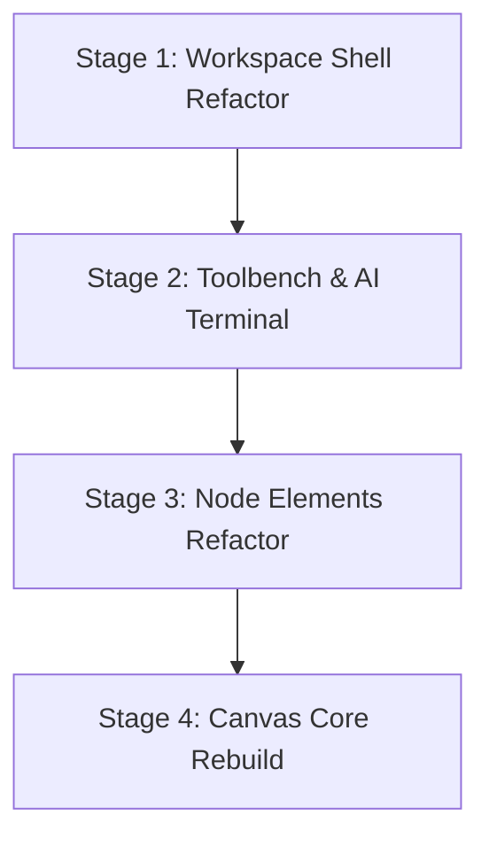

# Editor Rebuild & Migration Plan

This document maps out the roadmap for refactoring the Umlify UML Editor from its current legacy structure to the unified design system. It details the component modules, color token alignments, current functional regressions, and proposes a staged migration timeline.

---

## 1. Editor Module Inventory

The editor workspace is divided into several modules distributed across shell layouts, rendering viewports, and property sheets:

### A. Workspace Shell Layer (`Home.vue`)
- **Master Header**: Coordinates, versioning indicators, theme toggle, and API network status alerts.
- **Telemetry Control Strip**: Handles undo/redo triggers, real-time coordinate inputs (X, Y, W, H, Z), zoom levels, and the AI Terminal toggler.
- **Sidebar Drawer**: Collapsible and resizable sidebar that alternates tabs between the shape spawner and cloud-synced files (supporting swipe-to-delete row animations).
- **AI Terminal Container**: Wrapper panel that houses the syntax compiler.

### B. Interactive Canvas Layer (`Canvas.vue`)
- **Marquee Selection Box**: Vector-bound box for drag-selecting multiple elements.
- **Draggable Element Viewports**: Renders coordinate-locked elements on the canvas grid.
- **Connection Anchors**: Perimeter handles (Top, Right, Bottom, Left) that serve as mouse-drag targets to link nodes.
- **Real-Time Vector Path Preview**: Path overlays showing the orthogonal connector draft path while dragging.
- **Alignment Guides**: Coordinate line overlays indicating horizontal/vertical alignment matches with adjacent static nodes.

### C. Toolbench & Control Panels (`Toolbar.vue` & `TerminalEditor.vue`)
- **Toolbar**: Spawns UML nodes (Actor, UseCase, System Boundary, Package, Note) via HTML5 drag-and-drop, and triggers JSON exports/snapshots.
- **TerminalEditor**: Operates the AI blueprint synthesis compiler (Gemini, OpenAI, Groq, OpenRouter) and displays raw JSON editor inputs.

### D. Visual UML Elements
- **`Actor.vue`**: Sticks-man SVG node with custom label text wrapping and handles.
- **`UseCase.vue`**: pill shape boundary enclosing editable text elements.
- **`System.vue` / `Package.vue` / `Note.vue`**: boundary containers that wrap other nodes.
- **`connector.vue`**: SVG line generator mapping relations (Association, Generalization, Realization, Aggregation, Composition, Dependency) via dynamic orthogonal clearance routing.

---

## 2. Design System Alignment & Legacy Inventory

Most of the editor modules were built using custom, ad-hoc Tailwind configurations. This creates visual inconsistencies and duplication.

| Module | Core styling / Theme variables | Primitive usage status | Design system action required |
| :--- | :--- | :--- | :--- |
| **`Home.vue`** | Custom colors (`bg-[#f8fafc]`, `bg-[#111827]`, `bg-rose-600`) | Does not use `Surface`, `Container`, `Stack`, or `Grid`. | Re-wrap shell components in Layer 2 `Surface` and `Stack` primitives. |
| **`Toolbar.vue`** | Custom grids, borders, and margins (`bg-zinc-50`, `border-zinc-200/60`). | Does not use `Grid`, `Stack`, or `Button`. | Swap custom grids with `Grid` primitive, and replace custom icons/buttons with `Button` and `Card`. |
| **`TerminalEditor.vue`** | Custom textareas, panels, and dropdowns. | Custom styled inputs, lacks base primitives. | Rebuild vendor dropdowns and key fields using `Input` and `Textarea` primitives. |
| **`Canvas.vue`** | Custom coordinate container. | Manually wraps SVGs and selection boxes. | Style drag selection layers and anchors using design system border tokens. |
| **Node Elements** | Custom border colors, hardcoded sizes, custom inputs. | Hand-styled textareas and container outlines. | Strip custom border definitions; style inner fields using standard text/border tokens. |
| **`connector.vue`** | Hardcoded Zinc and Violet stroke rules. | SVGs styled with legacy color themes. | Bind vector strokes to semantic tokens (e.g. `--color-border-default` and `--color-interactive-accent`). |

---

## 3. Current Refactor Regressions

A structural review of the editor canvas reveals several regressions introduced during the migration to Tailwind CSS v4 and the layout primitives refactor:

### Regression A: Undefined Theme Color References
- **Impact**: Selected elements, connection paths, drag marquee guides, and snap lines are **partially or completely invisible**.
- **Root Cause**: 
  - `Canvas.vue` and `connector.vue` reference `--accent-violet`, `--accent-violet-glow`, and `--color-accent-blue` directly.
  - Tailwind v4 styles inside [style.css](file:///c:/Users/Adem/Desktop/Portfolio%20Projects/Vue.js/UML-IFY/UMLify-ui/src/style.css) do not define these variables.
  - **Solution**: Bind these selectors to `--color-interactive-accent` (the standard design system accent token).

### Regression B: Conflicting Mouse Drag Event Listeners
- **Impact**: Dragging nodes on the canvas causes **erratic movement, coordinate jumps, or drag-release failures**.
- **Root Cause**:
  - `Canvas.vue` listens to `@mousedown.stop="initiateElementsDrag"` on the outer element wrapper.
  - Concurrently, node components like `Actor.vue` and `UseCase.vue` listen to `@mousedown="startDrag"` internally.
  - This creates conflicting pointer event loops.
  - **Solution**: Delete all internal dragging and resizing logic from child node files, delegating coordinate transforms exclusively to the parent `Canvas.vue`.

### Regression C: Hardcoded Contrast Halo (Blinding Label Text)
- **Impact**: Selected connector labels are **unreadable or visually distracting in Dark Mode**.
- **Root Cause**:
  - `connector.vue` applies a hardcoded white outline (`stroke: #fafafa;`) around relationship names.
  - In dark mode, this creates a bright glow overlaying dark nodes.
  - **Solution**: Bind label text strokes to theme variables (e.g., using `--color-bg-base` as the outline stroke mask).

---

## 4. Staged Migration Plan

To rebuild the editor safely without breaking functionality, we will execute the refactor in four sequential, isolated stages:

### Stage 1: Workspace Shell Refactor
*   **Target File**: `Home.vue`
*   **Objectives**:
    - Replace the outer page shell and inner panel dividers with `Surface`, `Stack`, and `Divider` layout primitives.
    - Re-implement the top header and telemetry bar components using `Button` and `Input` controls.
    - Ensure all container borders and glassmorphic blurs use design system tokens.

### Stage 2: Toolbench & AI Terminal
*   **Target Files**: `Toolbar.vue`, `TerminalEditor.vue`
*   **Objectives**:
    - Replace shape-spawner card grids with the `Grid` and `Card` primitives.
    - Migrate API key selectors, prompt textarea buffers, and JSON inputs to the Layer 1 `Input` and `Textarea` primitives.
    - Align error logs and compiler success notifications with the semantic options of `Badge` and status components.

### Stage 3: Node Elements Refactor
*   **Target Files**: `Actor.vue`, `UseCase.vue`, `System.vue`, `Package.vue`, `Note.vue`
*   **Objectives**:
    - **Remove redundant drag and resize handlers** from all child node components.
    - Clean up inline styles; inherit standard backgrounds and rounded corners from Layer 1 and 2 rules.
    - Bind inner input elements to standardized focus outlines.

### Stage 4: Canvas Core Rebuild
*   **Target Files**: `Canvas.vue`, `connector.vue`
*   **Objectives**:
    - Re-bind selection paths, alignment lines, and connector stroke coordinates to `--color-interactive-accent`.
    - Correct connector text halos in dark mode by dynamically updating SVG stroke masks.
    - Validate snap-to-grid coordinate physics and test multi-element drag mechanics.
