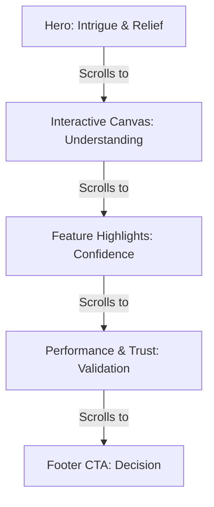

# Umlify Landing Page UX Blueprint
*A Conversion-Optimized Information Architecture & Storytelling Framework*

---

## 1. The User Journey (Psychological Progression)

The user journey is structured to move the visitor from initial intrigue to high-conviction conversion.



### Stage 1: The Landing (Hero Section)
*   **What they see:** A razor-sharp, typographic headline; a clean, sub-pixel grid background; a floating desktop-preview mockup of Umlify in action; and a clear, un-cluttered CTA button with keyboard hints.
*   **What they think:** *"This looks clean. It’s definitely designed for developer ergonomics."*
*   **What they feel:** Relief. The absence of chaotic animations, glowing neon blobs, or generic illustrations immediately signals a premium tool.
*   **Why they continue scrolling:** They want to see if the interface is as fast and intuitive in practice as the headline claims.

### Stage 2: The Proof (Interactive/Video Walkthrough)
*   **What they see:** A short, high-fidelity visual loop or an interactive canvas preview demonstrating real-time UML syntax conversion and layout generation.
*   **What they think:** *"It actually auto-routes the connectors. I don’t have to drag lines and snap them manually."*
*   **What they feel:** Curiosity and excitement. They recognize the time-saving potential.
*   **Why they continue scrolling:** They want to see how it handles large-scale systems and if it supports standard UML architectures.

### Stage 3: The Capabilities (Feature Grid)
*   **What they see:** A structured grid highlighting three key features: Keyboard-driven diagram editing, presentation-ready code export, and multi-format integration (GitHub, Markdown, PDF).
*   **What they think:** *"This integrates with my existing workflow. It's not just a standalone drawing app."*
*   **What they feel:** Confidence. They see that Umlify is a robust utility, not a toy.
*   **Why they continue scrolling:** They want to verify stability, speed, and standard compliance (trust verification).

### Stage 4: The Validation (Social Proof & Standards)
*   **What they see:** Performance metrics (e.g., canvas load times, rendering engine speed), supported UML schemas, and testimonials from engineers at tech-focused companies.
*   **What they think:** *"If teams at high-growth engineering companies are using it, it will scale to my project sizes."*
*   **What they feel:** Reassurance and trust. The technical credibility makes it a safe choice.
*   **Why they continue scrolling:** To take action.

### Stage 5: The Commitment (Final CTA)
*   **What they see:** A focused, high-contrast CTA block asking them to try the editor immediately in their browser, with no signup required.
*   **What they think:** *"No credit card, no sign-up wall, I can try it in 5 seconds."*
*   **What they feel:** Ready. The friction is zero.
*   **Why they convert:** The path of least resistance.

---

## 2. Landing Page Structure

This structure enforces a logical flow, addressing user concerns before asking for a conversion.

| Section | Purpose | Key Message | Target Emotion | Priority | Height | Justification |
| :--- | :--- | :--- | :--- | :--- | :--- | :--- |
| **01. Hero** | Hook the visitor and state the value proposition. | "The fastest way to design professional UML diagrams." | Relief & Focus | Critical | ~90vh | Must immediately filter the target audience and establish brand status. |
| **02. Interface Walkthrough** | Show the tool in action. | "Write code, get layouts instantly." | Excitement | High | ~80vh | Visitors want to see the product immediately. Text is not enough; visual proof must follow the hero. |
| **03. Deep Capabilities** | Highlight ergonomic features. | "Designed for the modern developer's workflow." | Confidence | High | ~100vh | Builds product depth. Shows that Umlify solves real-world pain points like exporting and keyboard flow. |
| **04. Trust & Compliance** | Establish technical authority. | "Standard compliant. Built for performance." | Trust | Medium | ~50vh | Validates that Umlify handles standard UML specifications and large diagrams without breaking. |
| **05. Final CTA / Footer** | Capture conversion. | "Design your first diagram in seconds." | Readiness | Critical | ~40vh | Placed at the natural end of the scroll journey, offering zero-friction entry into the editor. |

---

## 3. Hero Strategy

The hero section must act as a filter, attracting technical professionals and deflecting casual visitors who want a basic whiteboarding tool.

```
┌────────────────────────────────────────────────────────┐
│                        NAVBAR                          │
├────────────────────────────────────────────────────────┤
│                                                        │
│             HEADLINE: SPEED & ELEGANCE                 │
│             Sub-headline: Core value proposition       │
│                                                        │
│                  [CTA] [Secondary]                     │
│                  Hotkey hint (e.g., press 'Enter')     │
│                                                        │
│       ┌────────────────────────────────────────┐       │
│       │                                        │       │
│       │        HIGH-FIDELITY APP MOCKUP        │       │
│       │                                        │       │
│       └────────────────────────────────────────┘       │
└────────────────────────────────────────────────────────┘
```

*   **Headline Objective:** Communicate speed and visual quality.
    *   *Direction:* "The fastest way to design clean, professional UML diagrams."
*   **Supporting Copy Objective:** Explain the mechanism of Umlify in developer-friendly terms.
    *   *Direction:* "Write standard-compliant UML or use our keyboard-first canvas to auto-layout class structures, sequence flows, and system architectures in seconds."
*   **CTA Strategy:** Double CTA. A primary action to launch the web editor directly, and a secondary action to view the documentation or templates.
*   **Visual Focus:** A high-fidelity, crisp screenshot or vector render of the Umlify editor workspace showing a complex class hierarchy. The design should showcase absolute alignment, beautiful line terminals, and a clean interface.
*   **First Impression:** High-grade engineering tool.
*   **What MUST NEVER Appear in the Hero:**
    *   No animated neon gradient rings circling the primary button.
    *   No generic, colorful floating abstract shapes that have no connection to UML.
    *   No marketing copy focusing on "synergy" or "AI transformation."

---

## 4. Storytelling Flow

A high-converting landing page is a narrative arc, not a list of features.

```
[Problem] Clunky Legacy UML / Messy Manual Drawing
  │
  ▼ (Introduce Umlify)
[Solution] Semantic, Auto-routed layouts built for speed
  │
  ▼ (Explain mechanism)
[How it works] Write or click -> Auto-layout -> Export
  │
  ▼ (Validate claims)
[Credibility] High performance canvas + Standard compliant UML
  │
  ▼ (Remove friction)
[Zero-Risk Entry] Try in browser, no login required
```

1.  **The Hook (Hero):** We state the value proposition clearly. The visitor realizes they are looking at a modern UML editor.
2.  **The Reveal (Interface Walkthrough):** As the visitor scrolls, the hero mockup naturally transitions into a crisp walkthrough. The story shifts from *assertion* ("We are fast") to *demonstration* ("Look how fast this sequence diagram compiles").
3.  **The Detail (Capabilities):** Once the user understands the primary flow, we introduce the auxiliary benefits. The narrative shifts from *how it works* to *how it fits your daily routine* (e.g., exporting to SVG, embedding in markdown, git integration).
4.  **The Proof (Trust):** We validate our performance claims. If we claim it's fast, we show it handles 100+ nodes instantly. If we claim it's compliant, we show standard UML spec badges.
5.  **The Invitation (CTA):** Having resolved the visitor's doubts, we present the final step: launching the app.

---

## 5. Trust Building

Trust signals must speak the language of engineers. Standard marketing badges ("#1 Product of the Day") are less effective than technical specifications.

### Recommended Trust Signals for Umlify
*   **Actual App Screenshots (High-Fidelity):** Show real, unedited diagrams in the editor. Faking UI mocks ruins credibility.
*   **Performance Metrics:** Explicitly display performance achievements.
    *   *Example:* "Render 10,000+ nodes at 60fps using our WebGL rendering engine."
*   **UML Standard Compliance Badges:** Explicitly list support for UML 2.5 standards (Class, Sequence, Use Case, State Machine, Activity diagrams).
*   **Developer-focused Social Proof:** Rather than generic reviews, display snippets of feedback from software engineers, tech architects, and technical educators.
*   **Workflow Compatibility Indicators:** Logos of developer tools Umlify integrates with (e.g., GitHub, VS Code, Markdown, SVG/PNG export).

---

## 6. Content Hierarchy

To keep the page minimal, clean, and high-impact, we categorize and filter all potential content.

```
┌────────────────────────────────────────────────────────┐
│ ESSENTIAL (Show prominent)                             │
│ - Live/Video app preview                               │
│ - Key UML types supported                              │
│ - Export features (SVG, Markdown, Code)                │
├────────────────────────────────────────────────────────┤
│ IMPORTANT (Support details)                            │
│ - Keyboard hotkey shortcuts reference                  │
│ - Engine performance stats                             │
│ - Dev-focused customer quotes                          │
├────────────────────────────────────────────────────────┤
│ OPTIONAL (Move to docs / secondary pages)              │
│ - Pricing details (keep landing focused on utility)    │
│ - Detailed tutorials or syntax guides                  │
├────────────────────────────────────────────────────────┤
│ REMOVE ENTIRELY (Do not include)                       │
│ - AI-generation marketing slogans                      │
│ - 3D floating characters / abstract shapes             │
│ - Non-technical testimonials                           │
└────────────────────────────────────────────────────────┘
```

### Essential (Show Prominently)
*   **Dynamic Product Demo:** Visual evidence of the editor's speed.
*   **Core Supported Diagrams:** Class, Sequence, Use Case, Activity.
*   **Export Options:** SVG, PNG, Markdown embed, and JSON state.
*   *Justification:* These address the core developer concerns: "Does it work?", "Does it support my diagram type?", and "Can I use the output in my documentation?".

### Important (Show in Supporting Sections)
*   **Keyboard Shortcut Cheat-sheet:** Visually mapping common operations to keys.
*   **WebGL/Canvas Performance Stats:** Evidence of handling large architectures.
*   **Developer Testimonials:** Real peer validation.
*   *Justification:* Solidifies the "premium tool" identity and handles objections regarding performance bottlenecks.

### Optional (Move to Documentation or Sub-Pages)
*   **UML Syntax Tutorials:** How to construct diagrams.
*   **Long Feature Lists:** Minor features like "custom color schemes" or "history tracking."
*   *Justification:* These clutter the page. Once a developer sees the core editor, they expect custom colors and history tracking as standard.

### Remove Entirely (Do Not Include)
*   **AI Buzzwords:** Avoid calling the layout engine "AI-powered." It is a mathematical layout engine. Engineers hate AI-washing.
*   **Corporate Stock Photography:** Photos of happy teams looking at a whiteboard.
*   **Generic Feature Overviews:** "Cloud storage" or "secure login"—these are baseline expectations for any SaaS, not selling points.

---

## 7. Calls to Action (CTA)

CTAs should feel like invitations to explore, not aggressive sales pitches.

### CTA Rules

*   **Primary CTA Wording:** "Launch Editor" or "Start Designing"
    *   *Why:* Action-oriented, direct, and transparent. Avoid marketing-heavy words like "Get Started for Free Today."
*   **Secondary CTA Wording:** "View Interactive Demo" or "Browse Templates"
    *   *Why:* Gives low-intent visitors an alternative path that still demonstrates the product's value.
*   **Subtext (The Friction Reducer):** Place a tiny monospace string under the primary button.
    *   *Example:* `No credit card required. Runs in browser.`
*   **Placement Frequency:**
    *   **Hero Section:** Primary and Secondary buttons placed side-by-side.
    *   **Navbar (Sticky):** A small, sharp button in the top right, only visible once the user scrolls past the Hero.
    *   **Footer Section:** A focused, high-contrast CTA card.
*   **Visual Prominence:** The primary button uses a solid color (e.g., pure white background with black text in dark mode) with a subtle border. The secondary button is transparent with a 1px border.

---

## 8. Desktop & Mobile Experience

The challenge is showing a complex canvas editor on a 6-inch vertical screen without losing the premium feel.

### Adaptation Strategy

*   **Hero Visuals:** On desktop, show the full editor UI mockup. On mobile, transition the mockup to a focused portrait preview of the completed UML diagram itself. Fiddling with code inputs and panels is hard to see on mobile; the focus must shift to the *output quality*.
*   **Interaction Showcases:** Replace hover-based demo animations with simple, tap-to-trigger auto-play video clips.
*   **Layout Reflow:** Multi-column grid lists (like the feature cards) collapse to a single-column layout. Avoid horizontal swipe carousels, which can break natural vertical scrolling rhythm.
*   **Typography Scaling:** Headings scale down using viewport units (e.g., `56px` on desktop down to `32px` on mobile) to prevent awkward word wrapping while keeping the bold editorial weight.

---

## 9. Common UX Mistakes to Avoid

*   **Feature Vomit:** Listing 30 tiny features in a giant, unorganized list. This overwhelms the user and hides the key value proposition (speed & quality).
*   **Vague Imagery:** Using abstract graphics instead of real app screenshots. If a visitor cannot tell what the app looks like after 10 seconds, they leave.
*   **Aggressive CTA Popups:** Showing a newsletter signup or a "book a demo" popup after 3 seconds of scrolling. This destroys trust and ruins the clean brand image.
*   **Poor CTA Contrast:** Making buttons blend too much into the background in the name of "minimalism." The primary button must always be the most prominent element on the page.
*   **Text Wall:** Writing long paragraphs of text. Developers scan pages. Content must be broken down into headers, code snippets, and short bullet points.
